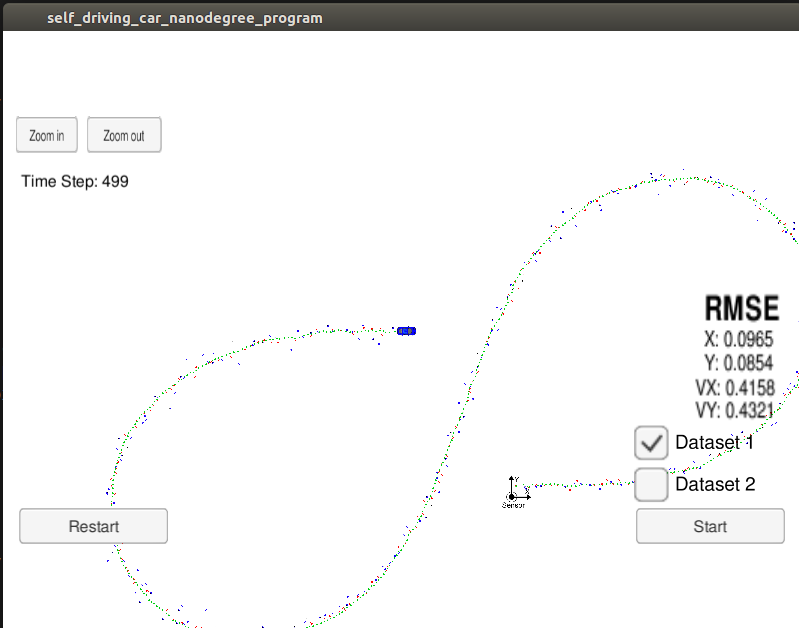
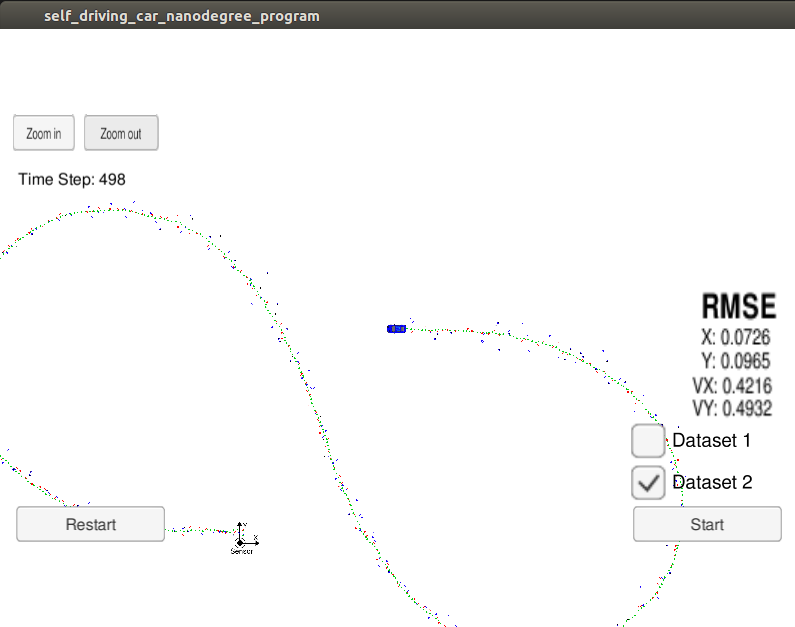

# CarND-Extended-Kalman-Filter-P1
Udacity Self-Driving Car Nanodegree - Extended Kalman Filter Implementation

# Overview
This project consists of implementing an [Extended Kalman Filter](https://en.wikipedia.org/wiki/Extended_Kalman_filter) with C++. A simulator provided by Udacity ([it could be downloaded here](https://github.com/udacity/self-driving-car-sim/releases)) generates noisy RADAR and LIDAR measurements of the position and velocity of an object, and the Extended Kalman Filter[EKF] must fusion those measurements to predict the position of the object. The communication between the simulator and the EKF is done using [WebSocket](https://en.wikipedia.org/wiki/WebSocket) using the [uWebSockets](https://github.com/uNetworking/uWebSockets) implementation on the EKF side.
To get this project started, Udacity provides a seed project that could be found [here](https://github.com/udacity/CarND-Extended-Kalman-Filter-Project).

# Prerequisites

The project has the following dependencies (from Udacity's seed project):

- cmake >= 3.5
- make >= 4.1
- gcc/g++ >= 5.4
- Udacity's simulator.


# Compiling and executing the project

These are the suggested steps:

- Clone the repo and cd to it on a Terminal.
- Create the build directory: `mkdir build`
- `cd build`
- `cmake ..`
- `make`: This will create two executables
- `ExtendedKF` : EKF implementation.
 
## Running the Filter

Run the simulator first and then from the build directory, execute `./ExtendedKF`. The output should be:

```
Listening to port 4567
Connected!!!
```
As you can see, the simulator connect to it right away.

The simulator provides two datasets. The difference between them are:

- The direction the car (the object) is moving.
- The order the first measurement is sent to the EKF. On dataset 1, the LIDAR measurement is sent first. On the dataset 2, the RADAR measurement is sent first.

### Here is the simulator final state after running the EKL with dataset 1:



### Here is the simulator final state after running the EKL with dataset 2:



# [Rubric](https://review.udacity.com/#!/rubrics/748/view) points

## Compiling

### Your code should compile

The code compiles without errors. No changes were made to the CMakelists.txt file.

## Accuracy

### px, py, vx, vy output coordinates must have an RMSE <= [.11, .11, 0.52, 0.52] when using the file: "obj_pose-laser-radar-synthetic-input.txt which is the same data file the simulator uses for Dataset 1"

The EKF accuracy was:

- Dataset 1 : RMSE <= [0.0965, 0.0854, 0.4158, 0.4321]
- Dataset 2 : RMSE <= [0.0726, 0.0965, 0.4216, 0.4932]

## Following the Correct Algorithm

### Your Sensor Fusion algorithm follows the general processing flow as taught in the preceding lessons.

The Kalman filter implementation can be found [src/kalman_filter.cpp](./src/kalman_filter.cpp) and it is used to predict at [src/FusionEKF.cpp](./src/kalman_filter.cpp#L119) line 119 and to update line 154 to 178.

### Your Kalman Filter algorithm handles the first measurements appropriately.

The first measurement is handled at [src/FusionEKF.cpp](./src/kalman_filter.cpp#L61) from line 69 to line 112.

### Your Kalman Filter algorithm first predicts then updates.

The predict operation could be found at [src/FusionEKF.cpp](./src/kalman_filter.cpp#L119) line 119 and the update operation from line 154 to 178 of the same file.

### Your Kalman Filter can handle radar and lidar measurements.

Different type of measurements are handled in two places in [src/FusionEKF.cpp](./src/kalman_filter.cpp):

- For the first measurement from line 82 to line 99.
- For the update part from line 160 to 173.

## Code Efficiency

### Your algorithm should avoid unnecessary calculations.

Few examples of this optimization are

* When the update function is called for both laser and radar measurements. The common code from both the functions is moved to a function  [src/FusionEKF.cpp](./src/kalman_filter.cpp#L87) line 87 to line 100.

* Updating the state transition matrix [src/FusionEKF.cpp](./src/kalman_filter.cpp#L129) line 129.

* Updating the noise covariance matrix Q. This can be found at [src/FusionEKF.cpp](./src/kalman_filter.cpp#L136) line 136.


